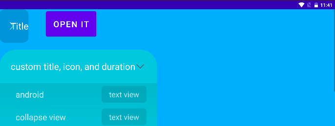

# Collapse View for Android

## example in code


```groovy
implementation 'io.github.crzy633:collapseview:0.0.2'
```


## how to use

```xml
<cool.parva.collapseview.CollapseView
	android:id="@+id/collapse_view"
	android:layout_width="300dp"
	android:layout_height="wrap_content"
	android:background="@drawable/shape_r16_bg">
    <TextView
		android:textSize="36sp"
		android:text="CollapseView should have just one body"
		android:layout_width="match_parent"
		android:layout_height="150dp"
		android:gravity="center"
		android:background="@drawable/shape_toggle_bg" />
</cool.parva.collapseview.CollapseView>
```


custom attributes

- `collapse_view_title`
- `collapse_view_icon`
- `collapse_view_duration`
- `collapse_view_open`

```xml
<cool.parva.collapseview.CollapseView
	android:id="@+id/collapse_view"
	android:layout_width="300dp"
	android:layout_height="wrap_content"
	android:background="@drawable/shape_r16_bg"
    app:collapse_view_title="custom title, icon, and duration"
    app:collapse_view_icon="@drawable/ic_toggle_red"
    app:collapse_view_duration="100"
    app:collapse_view_open="true">
    <TextView
		android:textSize="36sp"
		android:text="CollapseView should have just one body"
		android:layout_width="match_parent"
		android:layout_height="150dp"
		android:gravity="center"
		android:background="@drawable/shape_toggle_bg" />
</cool.parva.collapseview.CollapseView>
```

  

`CollapseView` should have only one child view, or one more head view:

```xml
<cool.parva.collapseview.CollapseView
    android:id="@+id/collapse_view"
    android:layout_width="300dp"
    android:layout_height="wrap_content"
    android:background="@drawable/shape_r16_bg">
    
    <cool.parva.collapseview.CollapseViewHead
		android:layout_width="match_parent"
		android:layout_height="wrap_content">
        <TextView
			android:textSize="36sp"
			android:textColor="@color/white"
			android:text="custom Head"
			android:layout_width="wrap_content"
			android:layout_height="wrap_content"
			android:layout_gravity="center" />
    </cool.parva.collapseview.CollapseViewHead>
    
    <TextView
		android:textSize="36sp"
		android:text="CollapseView should have just one body"
		android:layout_width="match_parent"
		android:layout_height="150dp"
		android:gravity="center"
		android:background="@drawable/shape_toggle_bg" />
</cool.parva.collapseview.CollapseView>
```


## a Bug

There is a bug.

If you use `android:layout_width="wrap_content"` on Collapse View, it may display wrong. Like:

```xml
<cool.parva.collapseview.CollapseView
	android:id="@+id/collapse_view"
	android:layout_width="wrap_content"
	android:layout_height="wrap_content"
	android:background="@drawable/shape_r16_bg">
    <TextView
        android:textSize="36sp"
        android:text="CollapseView should have just one body"
        android:layout_width="match_parent"
        android:layout_height="150dp"
        android:gravity="center"
        android:background="@drawable/shape_toggle_bg" />
</cool.parva.collapseview.CollapseView>
```



this is because the body view's visibility attribute will be set to `"gone"` in the code.


## 
