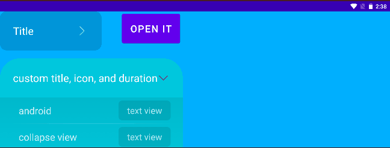

# Collapse View for Android

## example in code




## how to use

```xml
<cool.parva.collapseview.CollapseView
    android:id="@+id/collapse_view"
    android:layout_width="wrap_content"
    android:layout_height="wrap_content"
    android:background="@drawable/shape_r16_bg">
        <TextView
            android:text="@string/default_style"
            android:layout_width="match_parent"
            android:layout_height="100dp"
            android:background="@drawable/shape_toggle_bg"/>
</cool.parva.collapseview.CollapseView>
```


attributes: `title`, `icon`, `duration`

```xml
<cool.parva.collapseview.CollapseView
    android:id="@+id/collapse_view"
    android:layout_width="wrap_content"
    android:layout_height="wrap_content"
    android:background="@drawable/shape_r16_bg"
    app:title="custom title"
    app:icon="@drawable/ic_toggle_red"
    app:duration="2000">
        <TextView
            android:text="@string/default_style"
            android:layout_width="match_parent"
            android:layout_height="100dp"
            android:background="@drawable/shape_toggle_bg"/>
</cool.parva.collapseview.CollapseView>
```

  

`CollapseView` should have only one child view, or one more head view:

```xml
<cool.parva.collapseview.CollapseView
    android:id="@+id/collapse_view"
    android:layout_width="wrap_content"
    android:layout_height="wrap_content"
    android:background="@drawable/shape_r16_bg">
    
    	<cool.parva.collapseview.CollapseViewHead
			android:layout_width="match_parent"
			android:layout_height="wrap_content">
            <TextView
                android:textSize="36sp"
                android:textColor="@color/white"
                android:text="custom Head"
                android:layout_width="wrap_content"
                android:layout_height="wrap_content"
                android:layout_gravity="center"
                tools:ignore="HardcodedText" />
		</cool.parva.collapseview.CollapseViewHead>
    
        <TextView
            android:text="@string/default_style"
            android:layout_width="match_parent"
            android:layout_height="100dp"
            android:background="@drawable/shape_toggle_bg"/>
</cool.parva.collapseview.CollapseView>
```